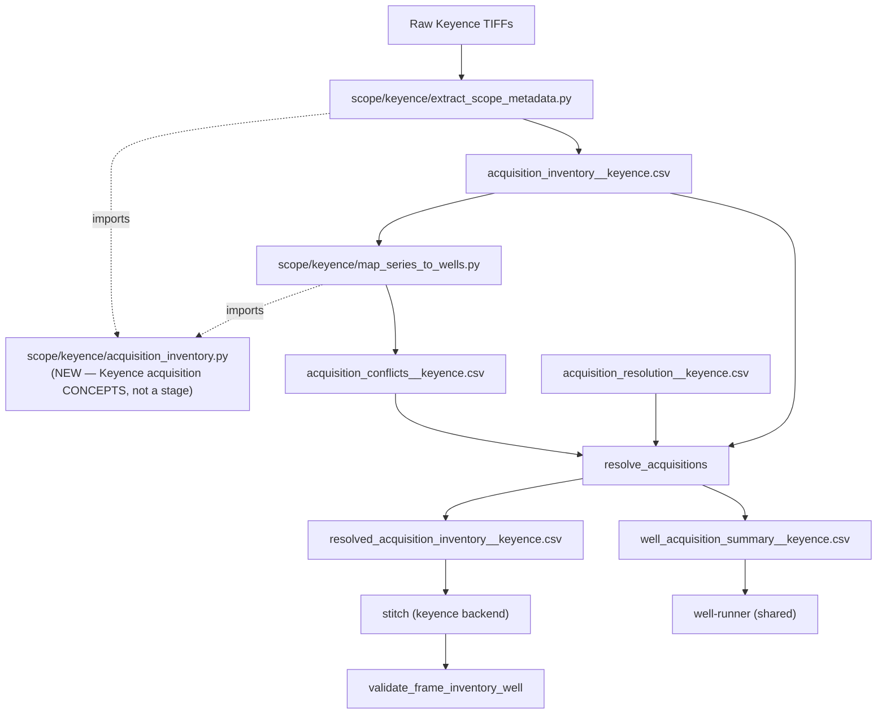

# Acquisition Inventory Flow — record-then-map, per scope (🟢 TARGET)

**Status:** active spec, mdcolon 2026-06-10. Defines the **acquisition inventory** — the
per-scope record of *what was physically acquired* — and how it flows from the one raw read
through conflict resolution into the microscope-specific stitcher.
**Companion to:** `front_end_naming_and_frame_inventory_flow.md` (the front-end ingest + fan
spec; this doc is the per-scope **upstream** record that feeds it) and
`frame_inventory_handoff_contract.md` (the **post-stitch** drop-in seam; the acquisition
inventory is its upstream counterpart — see "Acquisition inventory ≠ frame inventory" below).
**Scope of THIS doc:** the per-scope `acquisition_inventory__{scope}.csv` (evidence), the
`acquisition_conflicts`/`acquisition_resolution`/`resolved_acquisition_inventory` layer, the
shared `well_acquisition_summary__{scope}.csv` contract, the re-acquisition data model, where
the pipeline halts, and the `paths.py`/rules/stages wiring.

> **Vocabulary note:** this doc uses standardized `*_index` axis names (`position_index`,
> `z_index`, `channel_index`, `time_index`) and `acquisition_time_s` (the raw per-image
> `ShootingDateTime`). It adopts the front-end doc's `time_index` (T dimension) vocabulary.

---

## 🗺️ ROADMAP — what's shared, what's scope-specific, and the build phases

**Refined 2026-06-10 (mdcolon).** Two boundary refinements supersede earlier framing in this doc:
the `well_acquisition_summary` is emitted by **`resolve`**, not `map`; and the shared surface is
**deliberately narrow** (almost everything upstream of stitched images is microscope-specific).

### What is SHARED vs MICROSCOPE-SPECIFIC (the thick boundary)

> **The hard microscope boundary is `stitched images on disk`. Everything upstream is
> per-scope; everything downstream is shared.** Keyence and YX1 do *genuinely different work*
> before images exist — **positions are addressed differently** (Keyence: folder `XY##`/`P##`
> tiles; YX1: ND2 stage-XY / series index), the **schemas differ** (TIFF-plane rows vs ND2-coord
> rows), and the **resolve logic differs** (Keyence reconstructs acquisitions from collisions;
> YX1 cells can't collide). So we share **as little as honestly possible**:

| Surface | SHARED? | Note |
|---|---|---|
| Collision/rectangularity **check-engine** | **SHARED** — but only as a *thin parameterized skeleton* | each scope **declares its own cell key + columns**; the engine is just the uniqueness/classify/rectangularity mechanics over a declared key. (A scope with no possible collision, like YX1, barely uses it.) |
| `acquisition_inventory__{scope}.csv` **schema** | scope-specific | different grain + columns per scope |
| `map_*` step, positions, mapping table | scope-specific | folder-parse vs XY-grid match |
| `resolve_acquisitions` **logic** | scope-specific | Keyence reconstructs; YX1 = passthrough |
| `well_acquisition_summary` **producer** | scope-specific | each scope's `resolve` fills it |
| `well_acquisition_summary` **3 generic columns** (`well_id`, `active_for_stitch`, `quarantine_reason`) | **SHARED contract** | the *only* thing shared orchestration reads — eligibility, not logic |
| `materialize_well` | scope-specific | consumes the resolved inventory (one raw read) |
| `frame_inventory` + everything after stitched images | **SHARED** | post-stitch, agnostic, P/Z collapsed |

> **The narrow-shared rule:** SHARE only the **check-engine skeleton** + the **3-column
> eligibility contract**. Do NOT pre-build shared schema/mapping/resolve modules before a second
> colliding scope forces them. ("Don't swallow the whale.")

### Two perpendicular boundaries (don't collide them)
- **Per-well fan** = ONE shared, early point (`discover_wells`). A well is a well on any scope.
- **Microscope boundary** = a horizontal line at stitched images. Each per-well step's
  *implementation* flips scope-specific → shared there.
- A quarantined well is still **discovered** but `active_for_stitch=false`; the shared well-runner
  reads only that boolean (eligibility), never the scope's collision columns.

### Artifact ownership (CORRECTED — summary moves to resolve)
```
ingest_scope_metadata   → scope_metadata__{scope}.csv  +  acquisition_inventory__{scope}.csv   (the ONE raw read)
map_series_to_wells     → series_well_mapping.csv       +  acquisition_conflicts__{scope}.csv    (NAMES conflicts)
resolve_acquisitions    → acquisition_resolution__{scope}.csv  +  resolved_acquisition_inventory__{scope}.csv
                          +  well_acquisition_summary__{scope}.csv   ◄── eligibility DECIDED here, so emitted here
stitch (scope backend)  → consumes resolved inventory → stitched images   ◄══ HARD MICROSCOPE BOUNDARY
```
> **Why summary at `resolve`, not `map`:** `map` only *names* that a well has a conflict.
> `resolve` *decides* `active`/`rejected`/`unresolved`. `active_for_stitch` is a **resolution
> decision**, so the table the well-runner trusts must be emitted by `resolve`.

### Build phases — and what the ACTUAL MVP is

> **This doc is the full TARGET architecture (coherent, probably correct) — it is NOT all an
> MVP.** The MVP is **Phase 1 only: the black-box recorder.** Record the inventory and inspect it
> on real data *before* letting it steer the car. The rest (conflicts, resolve, stitch rewiring,
> well-runner, validators) is the drawbridge and gatehouse — build the lantern first.

```
PHASE 1 — RECORD  ◄══ THE MVP (record-only; no downstream behavior change)
   add shared check-engine + Keyence acquisition concept/schema;
   extract emits acquisition_inventory__keyence.csv; register that artifact only;
   Snakefile +output only.
PHASE 2 — MAP/RESOLVE   (first behavioral change) map reads inventory (drop 2nd raw walk) → conflicts;
                        NEW resolve_acquisitions → resolution + resolved inventory + summary; quarantine.
PHASE 3 — CONSUME   (the real cutover) stitch reads resolved inventory (kill 3rd raw walk);
                    kill silent keep="first"; acquisition validator (full cell) vs frame_inventory
                    validator (stitched, unchanged) distinct; well-runner active_for_stitch filter.
```

> **MVP success criteria (Phase 1):**
> - `acquisition_inventory__keyence.csv` exists, registered in `paths.py`.
> - **one row per raw TIFF plane**, carrying the locked addressing axes + `acquisition_time_s` +
>   `source_image_path` (+ provenance/calibration).
> - a clean 14-plane Z-stack is **14 clean rows, not a collision**.
> - a known re-acquired well is **visibly detectable** by grouping the CSV on the cell key (no
>   resolution logic yet — just that the evidence makes the collision *visible*).
> - **no downstream behavior changes** (`map`/`resolve`/`stitch`/well-runner untouched).

---

## 🪨 THE ORGANIZING DISTINCTION — role vs. shape vs. contract

The single most important idea in this doc, stated first so everything hangs from it:

```
acquisition inventory          = a shared ROLE      (every scope may emit one)
acquisition inventory SCHEMA   = microscope-SPECIFIC (each scope stores raw data differently)
shared-facing CONTRACT         = a SMALL shared interface (well_acquisition_summary, identity/status)
```

> **The acquisition inventory is NOT a universal physical table. It is a per-scope contract.**
> Every microscope backend's inventory answers the **same question** — *"what raw acquisition
> units exist for each well, and how does this scope's stitcher address them?"* — but the **row
> grain and columns are microscope-specific**, because each scope stores raw data differently.

So we do **not** say "acquisition_inventory.csv is one row per raw TIFF" as a universal
statement. We say:

- **Keyence:** `acquisition_inventory__keyence.csv` is **one row per raw TIFF plane**.
- **YX1:** `acquisition_inventory__yx1.csv` would be **one row per addressable ND2
  frame/series coordinate** — *not* one row per TIFF.

The shared concept is **not the row grain.** The shared concept is: *"a table of raw
acquisition units, addressable by `well_id`, that the scope-specific stitcher can consume."*

### Scope-shaped inventories: same role, different schemas

| Scope | `raw_acquisition_unit` | Address columns | Payload pointer |
|---|---|---|---|
| **Keyence** | one **TIFF plane** | `well_id, position_index, z_index, channel_index, time_index_claimed, shooting_date_time` | `source_image_path` |
| **YX1** | one **ND2 frame/series coordinate** | `well_id, series_index, channel_index, time_index_claimed` | `source_nd2_path` |
| **Future** | scope-specific raw unit | scope-specific address columns | path **or** index pointer |

> **`raw_acquisition_unit` — define it once:** *the smallest raw thing a microscope backend can
> independently address during stitching.* Keyence: a TIFF plane (a separate file). YX1: an ND2
> coordinate (**not** a separate file — the planes live inside one ND2). This term avoids the
> TIFF-vs-ND2 confusion: "one row per raw unit" is universal; "one row per TIFF" is Keyence-only.

### The architectural rule (protects shared code)

> **The inventory schema is owned by the microscope backend, not by shared code.** Shared code
> may require common **identity/status** columns, but it **must not assume** Keyence columns like
> `position_index`, `z_index`, or `source_image_path` exist for every scope. Making
> `source_image_path` universal would be **wrong for ND2** (YX1 has no per-plane path).

This is the reason **Keyence/cans needs its own acquisition inventory format**: its raw data is
a folder sprawl of TIFF planes, while YX1 is indexed inside one ND2.

### The full per-scope stack (ALL scope-shaped, including the resolved view)

```
acquisition_inventory__{scope}.csv        ← scope-specific EVIDENCE   (raw units that exist)
acquisition_conflicts__{scope}.csv        ← scope-specific CONFLICTS  (ambiguous cells)
acquisition_resolution__{scope}.csv       ← scope-specific DECISIONS  (active|rejected|unresolved)
resolved_acquisition_inventory__{scope}.csv ← scope-specific OPERATIONAL VIEW (stitch consumes)
well_acquisition_summary__{scope}.csv     ← the SHARED-FACING per-well contract (small, identity/status)
```

> **⚠️ The RESOLVED inventory is STILL microscope-specific.** It preserves the same
> scope-shaped addressing the stitcher needs — it is not a universal schema. For Keyence,
> `resolved_acquisition_inventory__keyence.csv` still carries `position_index, z_index,
> channel_index, time_index_claimed, source_image_path, acquisition_group`. For YX1, a resolved
> view (if emitted) uses ND2 addressing (`series_index, channel_index, time_index_claimed,
> source_nd2_path`). **Only the scope's own stitcher consumes the resolved inventory.**

### The shared interface is a SEPARATE small table — `well_acquisition_summary__{scope}.csv`

Shared orchestration (discovery, the well-runner) must **not** depend on Keyence-only resolved
columns. So the shared-facing contract is its own **per-well summary**, one row per `well_id`:

```
well_acquisition_summary__{scope}.csv   (one row per well_id — the SHARED contract)
   well_id
   well_acquisition_status        # clean | duplicate_*_collapsed | acquisition_conflict_* | malformed_*
   active_for_stitch              # bool — the single field shared code reads
   quarantine_reason              # human string when not active
   n_raw_units                    # provenance / summary counts
   n_conflict_cells
   n_acquisition_groups
```

Then the division of labor is clean:

```
scope-specific stitcher   consumes  resolved_acquisition_inventory__{scope}.csv  (full addressing)
shared well-runner        consumes  well_acquisition_summary__{scope}.csv        (well_id + active_for_stitch)
discover_wells            UNCHANGED, microscope-agnostic                          (emits all well_ids)
run_wells = discovered ∩ target_wells − {well_id : active_for_stitch is false}
```

This keeps the **shared contract small** and prevents shared code from ever depending on
`position_index`/`z_index`/`source_image_path`.

---

## 🧭 Acquisition inventory ≠ frame inventory (two DIFFERENT kinds of information)

These are easy to conflate and must be kept distinct — they sit on **opposite sides of stitch**
and answer different questions:

| | **acquisition inventory** (this doc) | **frame inventory** (`frame_inventory_handoff_contract.md`) |
|---|---|---|
| **When** | **UPSTREAM** of stitch (raw side) | **DOWNSTREAM** of stitch (stitched side) |
| **Grain** | per **raw acquisition unit** (TIFF plane / ND2 coord) | per **stitched frame** `(well, channel, time)` |
| **Shape** | **microscope-SPECIFIC** (scope-shaped) | **microscope-AGNOSTIC** (one shared schema) |
| **Pixels** | points at **raw** planes (Z-stacks, tiles) | points at **one stitched, flat-fielded** image per frame |
| **Question** | *what was physically acquired, how does this scope address it?* | *what trusted per-frame images does segmentation read?* |
| **Z / tiles** | **present** (the inventory IS the z-stack/tile lookup) | **collapsed away** (one image per frame) |

> **The relationship:** the acquisition inventory is the **raw, scope-specific record** that the
> scope's stitcher consumes to **produce** the stitched images; the frame inventory is the
> **stitched, shared record** that travels with those images into segmentation. The stitcher is
> the boundary: scope-shaped acquisition inventory in → microscope-agnostic frame inventory out.
> This doc is the **upstream** counterpart of the frame-inventory handoff contract.

---

## Context — why this exists

Keyence ("cans") data is the messy microscope. Unlike YX1, a Keyence well is **not one file** —
it is a sprawl of TIFFs, one per `(well, position, z, channel, time)` cell, scattered across
`XY##/`, `P##/`, `T####/` folders. The pipeline reassembles those TIFFs into wells by
**folder-name parsing alone** (`_extract_well_from_path`, `_infer_keyence_stack_lookup`), keying
everything on `(well_index, time_int)`.

That works until a well is **re-acquired** — imaged a second time (a refocus, a restart, an
operator redo). Both passes' tiles land in the *same* `XY##/` + `T####/` folders, so:

- The stitch grouping key `(well_index, time_int)` collects **both passes into one bucket** → a
  3-tile well becomes 6 tiles → a doubled stitched image (720×3420 instead of 720×1710), or
  silently overwritten tiles.
- The Build01 merge sees **two rows for the same `(well, time_int)`** → row inflation → the
  downstream `iloc`/`loc` crash fixed on `main` in commit `9418c834`.

The legacy `main` fix (`9418c834`) only **detects + warns**, because — in its own words — *"the
grouping signal (per-image `ShootingDateTime`) lives on the RAW Keyence images and is already
stripped from these FF tiles."* So it cannot tell which tile belongs to which acquisition. Its
TODO punts the real fix to "a downstream QC layer that groups tiles by real raw image metadata."

**The load-bearing realization:** that grouping signal is **not** actually lost.
`ingest_scope_metadata` (the architecture's *one raw read*) **already opens every raw TIFF and
already reads `ShootingDateTime`** (`extract_scope_metadata.py:69,97`) — then **throws the
per-image timestamp away**, collapsing each TIFF into one `(well, time_int)` row and folding the
timestamp into a single `experiment_time_s`. So the robust fix is **not** a second raw read in a
downstream QC layer (that violates "ONE raw read"). It is: **record the per-raw-image acquisition
facts at the one place we already read them, before they are stripped — then map raw units back
to acquisitions from that record.**

---

## The core modeling question

> *"A raw unit is just one part of a well — how do we tie it to (well, acquisition, timestamp),
> especially for true time-series data?"*

A Keyence raw TIFF is one cell in a grid; name the axes uniformly (PTZCYX):

```
raw TIFF  ≙  (well_index, position_index, z_index, channel_index, time_index_claimed)  + acquisition_time_s
            └────────────── from folder/filename parsing (ADDRESSING axes) ───────────┘   └ TIFF XML (measured) ┘
            Y/X are the PIXELS inside the file (payload axes) — never columns
```

`time_index_claimed` (folder `T####`) is the **problem child**: it's derived from the folder
name, so a re-acquisition that reuses the same `T0000/` folder **collides** on `time_index`
even though it is a physically distinct acquisition.

**Two distinct jobs `acquisition_time_s` does — keep them separate:**

- **Δt across the time series (unchanged from today).** Within one well, sort the *distinct*
  cells by time and `diff` their timestamps — consecutive `time_index`es are separated by the
  real frame interval. This is today's `experiment_time_s`/`frame_interval_s` math
  (`extract_scope_metadata.py:331-344`); **this plan does not change it.**
- **Re-acquisition detection — by GRID-CELL collision, classified by CONTENT.** Re-acquisition is
  **two raw units claiming the same grid cell**. The timestamp *describes/orders* the colliding
  passes; **content (hash) decides** whether they're a true duplicate or a real conflict (see
  Uniqueness below). The timestamp may be missing on messy data; content cannot.

> `time_index` is the **CLAIM** (an addressing coordinate). `acquisition_time_s` is the
> **EVIDENCE** that adjudicates a collision on that claim. When two units collide on one
> `time_index`, the timestamp says whether they're the same acquisition (dupe) or two
> acquisitions both labeled the same `time_index` (re-acquisition) — but **content is the
> ground-truth fallback when the timestamp is absent.**

---

## The data model — `acquisition_inventory__{scope}.csv`

Written by `ingest_scope_metadata` (the scope backend) — the **same stage, same single raw
read** that already opens every raw unit. It does **not** collapse: it records the full grid
cell + the timestamp, before any well-level aggregation.

### 🔑 PERSIST the raw per-image `ShootingDateTime` — never throw it away

The inventory is the **system of record for acquisition time.** Every row keeps the **per-image,
raw, un-aggregated** `ShootingDateTime` as `acquisition_time_s` — one value **per raw unit**,
exactly as read. Today's extractor is lossy two ways, both undone here: it (a) folds the
per-image timestamp into a single per-well `experiment_time_s`/`absolute_start_time`, discarding
the per-image value, and (b) keeps only the derived seconds. Target: the inventory **persists the
raw per-image timestamp on every row**; `experiment_time_s`/Δt become columns *computed from* it,
never a replacement. The raw fact must be recoverable **without re-reading the raw file.**

### Keyence schema (one row per RAW TIFF)

| Column | Meaning | Source |
|---|---|---|
| `experiment_id` | global experiment id (atom) | constant |
| `well_index` | local well label `A01` (atom) | `_extract_well_from_path` |
| `well_id` | global `{experiment_id}_{well_index}` | `build_well_id` (`extract_scope_metadata.py:287`) |
| `position_index` | tile/position (P) within the well | `_extract_keyence_well_and_tile` |
| `z_index` | Z-plane (Z) | `_parse_keyence_time_and_z` |
| `channel_index` / `channel_id` | channel (C) — numeric index + normalized token | `_normalize_channel_name` |
| `time_index_claimed` | folder-derived `T####` (T, the **claim**) | folder parse |
| `acquisition_time_s` | **raw per-image `ShootingDateTime` — preserved per row** | TIFF XML |
| `source_image_path` | the raw TIFF path (the Y×X pixel plane) | walk |

A 14-plane z-stack = **14 rows** sharing `(well_id, time_index_claimed, position_index,
channel_index)`, differing only in `z_index` — each row keeps its own `acquisition_time_s`.
Most atomic (grep one plane), append-only, and collision detection counts rows per cell directly.

### YX1 schema (one row per addressable ND2 frame/series coordinate)

```
acquisition_inventory__yx1.csv
   experiment_id, well_index, well_id, series_index, channel_index, time_index_claimed,
   acquisition_time_s (if available), source_nd2_path
   # NO per-plane source_image_path — P + Z are array axes INSIDE the ND2; Y/X are pixels
```

YX1's stitcher does `dask_arr[time_int, series_index, Z, channel_index, Y, X]`
(`materialize_stitched_images.py:140`); a frame's address is a **tuple of indices into one
file** (`series_index` from the mapping, `channel_index`, `time_index`). So YX1 has no per-plane
file path. (Because the ND2 has one well-defined `(time, series, channel)` cell per frame,
**re-acquisition collisions are Keyence-only** — YX1 wells are `clean` by construction.)

---

## How UNIQUENESS is determined (the crux — and why the timestamp is NOT in the key)

The uniqueness key for a Keyence raw unit is the full **addressing grid cell**:
`(well_id, position_index, z_index, channel_index, time_index_claimed)`. Exactly **one** raw TIFF
should occupy each cell. Re-acquisition is a **violation** of that key.

```
uniqueness key (should be 1 row each):  (well_id, position_index, z_index, channel_index, time_index_claimed)
   exactly one row on the cell                       → unique / clean
   ≥2 rows on the cell → classify by CONTENT (ground truth), time corroborates:
        identical bytes (same hash)                  → TRUE DUPLICATE  → auto-collapse
        different bytes                              → RE-ACQUISITION  → conflict, quarantine
```

> **⚠️ CONTENT decides, not the timestamp (the gotcha — what if `acquisition_time_s` is
> missing?).** Keyence data is messy; the timestamp may be absent/unparseable. So the
> duplicate-vs-conflict decision **cannot depend on the timestamp being present.** Ground truth
> is **content**: identical bytes → dupe (true regardless of timestamp); different bytes →
> conflict (also regardless). `acquisition_time_s` is **corroboration + pass-ordering** (group 0
> vs 1 by time) — never the sole decider. Degrades gracefully on exactly the messy "cans" data
> the design exists for.

> **Why `acquisition_time_s` stays OUT of the uniqueness key.** If it were *in* the key, every
> twin would get a different key value and look "unique" — the collision would never fire
> (today's silent bug). Uniqueness is on the **cell**; **content** classifies; the timestamp
> corroborates and orders.

> **The silent bug this fixes (verified `materialize_stitched_images.py:431`).** Today stitch
> does `drop_duplicates(subset=["experiment_id","well_id","well_index","channel_id","time_int"],
> keep="first")` — a key that **omits `position_index` and `z_index`** and resolves any collision
> by **`keep="first"` (a silent coin-flip)**. So a re-acquired pass is dropped with **no record
> it existed.** Fix: (1) the uniqueness key **includes P and Z** (a legitimate 14-plane z-stack
> is 14 distinct rows, not "duplicates"); (2) a real collision is **detected + named**
> (conflict→quarantine / true-dup→collapse), **never silently first-wins.** (Generalizes the
> handoff contract's per-`(well,channel,time)` uniqueness to the full cell; the frame-contract
> `UNIQUE_KEY`, `frame_contract.py:28`, gains P/Z when the gate is promoted.)

---

## The inventory is a DURABLE BUILD ASSET (the stitch z-stack lookup)

The inventory's most important second life: **it is the canonical z-stack/tile lookup the
scope's stitcher reads** — not merely a conflict-detection scratchpad. It enumerates, per
`(well_id, position_index, channel_index, time_index_claimed)`, every raw plane (`z_index` +
`source_image_path`) — exactly the `(well, tile) → [z-ordered paths]` structure the Keyence
stitcher assembles, and exactly what a **future z-stack save/process** feature needs.

**The third raw walk this kills (verified `materialize_stitched_images.py:226-238`).** Today
`_infer_keyence_stack_lookup(raw_images_dir)` does `raw_images_dir.rglob("*CH*.tif")` and
re-derives the stack lookup — a **third** raw walk (after `extract`'s and `map`'s). Target:
**stitch reads the resolved inventory** for its lookup instead of re-walking. So "ONE raw read"
finally holds **end-to-end** — `extract` is the only stage that opens a raw file.

```
acquisition_inventory__{scope}.csv
        ├─► conflict detection  (map)            — IS this well clean?
        └─► z-stack lookup       (resolve→stitch) — WHICH planes make this tile's stack?
                                                    (+ future: save/process the z-stack)
```

**How the stitcher reassembles (the "is it clear how to stitch?" contract).** The stitcher
already does the grouping itself; one-row-per-unit hands it the **join key as named columns**, so
assembly is a deterministic groupby — no guessing:

```python
for (well_id, time_index, position_index, channel_index), grp in inv.groupby(
        ["well_id", "time_index_claimed", "position_index", "channel_index"]):
    z_stack_paths = grp.sort_values("z_index")["source_image_path"].tolist()   # one tile's Z-stack
    # → project to a focus tile, then mosaic tiles across position_index  (scope-specific)
```

> One-row-per-unit is **clearer** for stitching, not muddier: the grouping recipe lives in
> column names (group by well/time/position/channel, order by z), visible and checkable — vs. a
> list-in-a-cell that hides the recipe, breaks append-only/grep-able evidence, and can't count
> rows for collisions. The inventory states **facts**; the stitcher states **assembly**.

---

## File organization — the "missing file" IS the inventory seam

`scope/keyence/` today vs. `scope/yx1/`:

```
scope/yx1/      extract_yx1_scope_metadata.py   map_yx1_series_to_wells.py   generate_xy_reference.py   validate_xy_reference_grid.py
scope/keyence/  extract_scope_metadata.py       map_series_to_wells.py        ← 2 files; the scope-specific resolution file is MISSING
scope/shared/   apply_series_mapping.py          validate_physical_well_mapping.py
```

YX1 has **4** files because its scope-specific complexity (resolving which well a stage position
is) gets its own named files. Keyence has **2** and is missing the file for **its** scope-specific
complexity: **reconstructing acquisitions from scattered tiles.** The folder shape already implies
the answer: each microscope folder holds `extract` + `map` + whatever resolution that scope needs.

**The smoking gun (`map_series_to_wells.py:29-113`):** today `map_series_to_wells_keyence`
**re-walks the raw directory** (`_discover_keyence_wells`, `_count_positions_per_well`) — a
forbidden **second raw read** AND a folder-count that doubles on re-acquisition. The new
acquisition logic does **not** bolt a stage on; it **replaces that brittle walk** with a read of
the recorded inventory. One source of truth, not two disagreeing walks.

### The self-documenting flow

```
extract_scope_metadata.py  (the ONE raw read)
    ├─► scope_metadata__{scope}.csv          (collapsed, per-frame — as today)
    └─► acquisition_inventory__{scope}.csv   ← NEW seam: one row per raw unit, un-collapsed
                       │
                       ▼  (CSV → CSV, NO second raw read)
map_series_to_wells.py   reads the inventory → NAMES conflicts             → series_well_mapping.csv,
                                                                            acquisition_conflicts__{scope}.csv
                       │
                       ▼
resolve_acquisitions     inventory ⋈ conflicts ⋈ resolution → resolved_acquisition_inventory__{scope}.csv,
                         DECIDES eligibility                 → acquisition_resolution__{scope}.csv,
                                                               well_acquisition_summary__{scope}.csv  ◄── summary HERE
                       │
                       ▼
stitch (scope backend)   reads the RESOLVED inventory → stitched images
                       │
                       ▼
validate_frame_inventory_well   BACKSTOP (image-level uniqueness)
```

### Where the LOGIC lives (DRY): one Keyence acquisition CONCEPT file

The acquisition **concepts** (grid-cell key, collision detector, `acquisition_group` assignment,
true-duplicate collapse, status enum) live in **one new file in `scope/keyence/`** (lean name
`acquisition_inventory.py`) — mirroring YX1's flat-file pattern, **not** a subpackage. The stages
are thin callers.

| File | Role | Imports the concept file? |
|---|---|---|
| `scope/keyence/extract_scope_metadata.py` | the one raw read; emits the inventory | yes — to shape the per-unit record rows |
| `scope/keyence/acquisition_inventory.py` *(NEW concept/hub)* | **owns the model** — pure functions over rows | — (it IS the home) |
| `scope/keyence/map_series_to_wells.py` | reads the inventory, names conflicts + status | yes — and **drops its raw-dir walk** |

---

## File dependency graph — declare the direction, enforce it

Two different graphs: the artifact flow (the **river**) and the import graph (the **plumbing**).
Declaring the river but leaving the plumbing implicit is what lets a codebase rot. So the
direction of dependency is **declared as a rule and enforced with a test**
(mirror `viz/tests/test_contract.py`).

> **The one sentence:** `acquisition_inventory__{scope}.csv` is the **artifact seam**;
> `scope/keyence/acquisition_inventory.py` is the **logic seam**. Extraction produces the seam,
> mapping consumes it, shared validation only checks the consequences.

> **The raw-read invariant, stated precisely (softened):**
> 1. **ONE raw discovery walk** — `extract` is the only stage that walks the raw directory.
> 2. **NO downstream raw-directory re-walks** — `map`/`resolve`/`stitch` read CSVs, never `rglob`.
> 3. **Targeted file reads for conflicted candidates ONLY are allowed** — `resolve` may open the
>    *specific* colliding TIFFs to content-hash them (duplicate vs conflict). That is a bounded,
>    by-`source_image_path` read of named candidates, **not** a rediscovery walk. The hash logic
>    and the "no re-walk" rule are consistent: no directory traversal, just opening listed files.



> **CORRECTED:** `summary` is emitted by **`resolve`** (`resolve --> summary`), not `map` —
> `map` only *names* conflicts; `resolve` *decides* `active_for_stitch` (an eligibility decision).

### The import rules (enforced, not honor-system)

```
stage files          depend on   concept files
concept files        depend on   (nothing in the pipeline — stdlib / pandas / identifiers only)
shared files         depend on   (nothing microscope-specific)
downstream/shared    consume     well_acquisition_summary + identity/status  (never scope-only columns)
```

| File | MAY import | MUST NOT import |
|---|---|---|
| `extract_scope_metadata.py` (stage) | `acquisition_inventory.py` | — |
| `map_series_to_wells.py` (stage) | `acquisition_inventory.py` | — |
| `acquisition_inventory.py` (**concept/hub**) | stdlib, pandas/pathlib, identifiers | stages, Snakemake/tasks, stitch, validators |
| `scope/shared/*` | (generic only) | any Keyence-specific acquisition logic |
| shared well-runner / discovery | `well_acquisition_summary__{scope}.csv` (`well_id`, `active_for_stitch`) | `position_index`/`z_index`/`source_image_path` or any resolved-inventory column |

**Same functions, two entry points:** `acquisition_inventory.py` exposes the model as **pure
functions over rows**. `extract` calls them with in-memory rows (no CSV roundtrip at the one raw
read); `map` calls them after reading the CSV. One logic seam, one artifact seam.

---

## The policy: record everything; quarantine conflicts; never pretend ambiguity is clean

When a well is re-acquired, the pipeline **records the full inventory (evidence), names the
candidate `acquisition_group`s, and HALTS that one well before stitch** — it does **not** guess
which pass to keep, and does **not** crash the plate. Any auto-pick (keep-latest/keep-sharpest)
is a guess about scientific intent. True duplicates (identical bytes) auto-collapse — noise, not
ambiguity.

### Evidence vs. resolution — separate files (truth vs. policy)

`acquisition_inventory__{scope}.csv` is **append-only truth** — every raw unit, no filtering, no
judgment. Raw files are **never deleted by the pipeline** — curation is a sidecar, not raw-dir
mutation.

```
acquisition_inventory__{scope}.csv          ← EVIDENCE (every raw unit, never filtered)
acquisition_conflicts__{scope}.csv          ← ambiguous cells (named candidate acquisition_groups)
acquisition_resolution__{scope}.csv         ← DECISIONS (active|rejected|unresolved, who/why)
resolved_acquisition_inventory__{scope}.csv ← inventory ⋈ resolution; the scope stitcher's view
well_acquisition_summary__{scope}.csv       ← the SHARED per-well contract (well_id, status, active_for_stitch)
```

### The decision tree (default conservative; auto-collapse only TRUE duplicates)

```
for each grid cell = uniqueness key (well_id, position_index, z_index, channel_index, time_index_claimed):
    one row                                → clean
    multiple rows (KEY COLLISION — classify by CONTENT; time corroborates, may be missing):
        exact-duplicate inventory rows     → auto-collapse, record duplicate_row_collapsed
        byte-identical TIFFs (hash match)  → auto-collapse, record duplicate_file_collapsed
        DIFFERENT bytes                    → acquisition_conflict → name acquisition_groups, HALT well
                                             (order groups by acquisition_time_s IF present, else by path)
        partial / non-rectangular          → malformed_acquisition_conflict → HALT well, fail loud
```

Default = **halt the well, require an explicit decision.** Opt-in modes
(`--duplicate-cell-policy best_focus|latest|earliest|manual_table`) exist but are never default;
**`manual_table` (the resolution sidecar) is the preferred real-world workflow.**

### Where it halts — on the TABLE, before stitch

At this step we are **not dealing with images yet — it's CSV.** So the first halt is
**table-level, gating entry into stitch** — not the image-opening frame-inventory gate (by then
you've already stitched the poison). Two complementary gates:

- **Primary (shared) — what actually prevents scheduling:** the well-runner subtracts wells where
  `active_for_stitch` is false → the per-well stitch job is **never requested**. (Reads
  `well_acquisition_summary`, never scope-only columns.) This is the gate that does the work.
- **Safety (DAG):** `resolved_acquisition_inventory__{scope}.csv` is a declared stitch `input:`,
  so if a quarantined well is requested *anyway*, stitch finds no resolved rows for it (or fails
  loud). *(Note: an experiment-level resolved CSV alone does not stop Snakemake from scheduling a
  per-well job — the well-runner's `run_wells` set does. This is a safety net, not the primary gate.)*
- **Backstop (image):** `validate_frame_inventory_well` fails loud post-stitch if a doubled
  image ever slips through.

> **Quarantined ≠ undiscovered.** Both are absent from the resolved set / `run_wells`, but an
> undiscovered well has **no usable evidence** while a quarantined well has **evidence that is
> unresolved.** A quarantined well is **listed** (in conflicts + the summary, with a status), so a
> user never wonders "where did B03 go?" — *B03 exists; quarantined; reason: duplicate grid-cell
> acquisition conflict; unresolved.*

### Quarantine, not crash

One conflicted well is held back; the other 95 proceed — the per-well-spine spirit. Resolution
un-halts: a human writes `acquisition_resolution__{scope}.csv`; the resolved view + summary
regenerate; the well re-enters the fan. Matches the `well_dispositions.csv` curation pattern
already on `main` (`1e25d106`/`6ecf2140`).

---

## Interface with `discover_wells` — quarantined = "discovered, not active"

`discover_wells` reads `scope_metadata_mapped.csv` and emits **every** `well_id`
(`tasks.py:142-159`). It is **below the convergence line** (shared, microscope-agnostic) and has
**no concept of acquisition status** — and must stay that way. So `discover_wells` is
**unchanged**; a quarantined well *is* still discovered.

The quarantine filter lives in the **well-runner**, which combines **three** inputs — separating
*discovered identity* (which wells exist) from *acquisition eligibility* (which may stitch):

```
discover_wells          → discovered_wells.{txt,csv}            one row per well that EXISTS (identity)
resolve_acquisitions    → well_acquisition_summary__{scope}.csv one row per well with acquisition STATUS
                                                                 (well_id | active_for_stitch | quarantine_reason)
select_run_wells        → run_wells.csv                        one row per well that should RUN
   (well-runner)          run_wells = discovered ∩ target_wells ∩ { well_id : active_for_stitch }
```

- **`discover_wells` owns discovered identity, NOT eligibility.** It reads
  `scope_metadata_mapped.csv` and emits **every** `well_id` (`tasks.py:142-159`) — unchanged,
  microscope-agnostic, no concept of acquisition status. A quarantined well *is still discovered.*
- **`resolve_acquisitions` owns eligibility** — it emits `well_acquisition_summary__{scope}.csv`
  recording `active_for_stitch` (the resolution decision).
- **The well-runner combines them** (a `select_run_wells` step): discovered ∩ target ∩
  acquisition-eligible → `run_wells`. It reads only the summary's 3 generic columns — never
  scope-only columns. *(Naming: the well-runner's run set is `run_wells` — matching
  `run_well_ids_for_experiment` in `well_runner.py` — not `active_wells`. `active_for_stitch` is
  the boolean COLUMN in the summary; `run_wells` is the resulting SET.)*

> **Why the well-runner, not discovery (convergence-line discipline):** acquisition status is a
> scope concept **above** the join; discovery is **below** it. Discovery emits identity; the
> runner intersects identity with eligibility. Discovery stays microscope-agnostic; the
> convergence line holds.

---

## `paths.py` / rules / stages wiring

Conforms to the philosophy doc recipe (*one row + one fn + one verb + one rule*) and Hard
Constraint 1 (no raw artifact-path strings). All artifacts carry the `{scope}` `format_vars`
token (Keyence-emitted; YX1-shaped or absent), exactly like `scope_metadata__{scope}.csv`.

### `PIPELINE_STEPS` rows (changed + new)

```python
# CHANGED — ingest gains the per-scope evidence artifact
"ingest_scope_metadata": {
    "stage": "experiment_metadata", "fanout": EXPERIMENT,
    "artifacts": {
        "raw": "scope_metadata__{scope}.csv",
        "acquisition_inventory": "acquisition_inventory__{scope}.csv",   # NEW (scope-shaped)
    },
},
# CHANGED — map gains conflicts only; it NAMES conflicts (does not decide eligibility)
"map_series_to_wells": {
    "stage": "experiment_metadata", "fanout": EXPERIMENT,
    "artifacts": {
        "mapping":   "series_well_mapping.csv",                          # + well_acquisition_status column
        "conflicts": "acquisition_conflicts__{scope}.csv",              # NEW (scope-shaped)
    },
},
# NEW STEP — the explicit resolve door; OWNS the summary (eligibility decided here)
"resolve_acquisitions": {
    "stage": "experiment_metadata", "fanout": EXPERIMENT,
    "artifacts": {
        "resolution": "acquisition_resolution__{scope}.csv",            # decision sidecar (human/auto)
        "resolved":   "resolved_acquisition_inventory__{scope}.csv",    # scope-shaped; stitch consumes
        "summary":    "well_acquisition_summary__{scope}.csv",          # MOVED from map — eligibility contract
    },
},
```

### Rules (Snakefile — config-dispatched, one rule per stage)

```
ingest_scope_metadata        +output: acquisition_inventory__{scope}.csv   (scope backend)
map_series_to_wells          +input:  acquisition_inventory   +output: conflicts
                                       (keyence backend reads inventory, drops the raw walk; NAMES conflicts)
resolve_acquisitions  (NEW)  in:  acquisition_inventory + conflicts [+ resolution if present]
                             out: resolved_acquisition_inventory__{scope}.csv + well_acquisition_summary__{scope}.csv
materialize_stitched_images  +input: resolved_acquisition_inventory__{scope}.csv   ← scope stitcher consumes
well-runner (shared)         reads: well_acquisition_summary__{scope}.csv          ← active_for_stitch only
discover_wells (checkpoint)  UNCHANGED — still reads scope_metadata_mapped.csv
```

> The halt is a **DAG edge**, not a runtime `if`. `resolve_acquisitions` is microscope-agnostic at
> the rule level (table dispatch); the scope shape lives in its inventory columns. (YX1's
> conflicts table is empty → resolve is a passthrough → every YX1 well is `clean`.)

### Stages-as-code

```
tasks.py (thin dispatch):  ingest-scope-metadata (+inventory) · map-series-to-wells (+conflicts) · resolve-acquisitions (NEW: +resolved/summary)
   → all import the pure functions from  scope/keyence/acquisition_inventory.py (the concept/hub)
     + the shared check-engine from  scope/shared/acquisition_engine.py
```

---

## Refactor items (the build pass; none executed in this doc)

1. **PERSIST the raw per-image `ShootingDateTime`.** `extract_scope_metadata.py` (Keyence) stops
   collapsing it into one per-well `experiment_time_s`; emits the un-collapsed
   `acquisition_inventory__keyence.csv` with `acquisition_time_s` per row + standardized `*_index`
   axes + `source_image_path`. The inventory is the system of record for acquisition time.
2. **`map_series_to_wells_keyence` reads the inventory, not the raw disk.** Delete the raw-dir
   walk (`map_series_to_wells.py:29-113`); call the shared check-engine's collision detector; write
   `acquisition_conflicts__keyence.csv` + the `well_acquisition_status` column. **NOT the summary**
   — `map` only names conflicts (eligibility is decided at `resolve`, item 3).
3. **Add `resolve_acquisitions`** (one row + one fn + one verb + one rule): inventory ⋈ conflicts ⋈
   resolution, auto-collapse true duplicates, quarantine conflicts →
   `resolved_acquisition_inventory__{scope}.csv` **+ `well_acquisition_summary__{scope}.csv`** (the
   eligibility contract, emitted HERE because `active_for_stitch` is a resolution decision).
   Default conservative; opt-in policy modes.
4. **Stitch READS the resolved inventory** (kill the THIRD raw walk,
   `materialize_stitched_images.py:226-238`) and gains it as a declared `input:` (the DAG halt).
   `_infer_keyence_stack_lookup` keys include the resolved acquisition.
5. **Kill the silent `keep="first"` dedup** (`materialize_stitched_images.py:431`); instead
   **assert the resolved acquisition inventory is unique on the full raw-unit key**
   `(well_id, position_index, z_index, channel_index, time_index_claimed)`. Collisions were already
   classified by **content** (hash) upstream at resolve; `acquisition_time_s` corroborates/orders.
   **The full-cell uniqueness lives on the ACQUISITION side — do NOT add P/Z to `frame_contract.py`.**
6. **Two distinct validators (keep the boundary clean):**
   - **Acquisition validator** — raw-side, scope-shaped: full raw-unit cell uniqueness
     `(well_id, position_index, z_index, channel_index, time_index_claimed)` + rectangularity.
     This is where P/Z uniqueness lives (the shared check-engine, scope-declared key).
   - **`frame_inventory` validator** — stitched-side, shared, stays **`(well_id, channel_id,
     time_index)`** (P/Z collapsed away by stitch). Use it only as a **backstop** that fails loud
     if a stitched frame's shape/count indicates doubled/invalid output. **Do NOT** add
     `position_index`/`z_index` to `frame_contract.py` `UNIQUE_KEY` — the frame inventory does not
     carry raw-unit provenance, and dragging raw-side columns across the stitched boundary is wrong.
7. **Register the new per-scope artifacts in `paths.py`** (inventory, conflicts, summary,
   resolution, resolved) — all via the registry, no raw path strings.
8. **Add `tasks.py` verbs** (`resolve-acquisitions`; extend ingest + map). Thin dispatch only.
9. **Well-runner combines three inputs into `run_wells`** (see §"Interface with `discover_wells`"):
   `run_wells = discovered ∩ target_wells ∩ acquisition_eligible`, where eligibility is
   `active_for_stitch == true` from the **shared summary** (never scope-only columns).
   `discover_wells` UNCHANGED — it owns *discovered identity*, not *eligibility*.
10. **Enforce import direction** with `test_no_forbidden_imports` (concept imports no stage;
    shared imports nothing scope-specific; shared code reads only the summary's 3 generic columns).

Carry forward from `frame_inventory_handoff_contract.md` "Upstream Capability to Transfer": the
heterogeneity that breaks collation (varying tile count / Z-depth) is the *same signal* as
re-acquisition — this inventory is the natural home for the `batch_size=1`-on-heterogeneity
capability the native stitch must preserve.

---

## Verification (for the eventual build)

- `20260414_b9d2_14hpf_plate02` — well **B03** re-acquired (6 tiles vs mode 3): each B03 grid cell
  must show **2 rows with DIFFERENT content** → conflict → 2 `acquisition_group`s; the well is
  quarantined (`active_for_stitch == false` in the summary; absent from the resolved inventory);
  the gate reports both passes; **all other wells clean.** Also verify a *true* duplicate
  (identical bytes) auto-collapses silently.
- `20260416_cep290_30to48hpf_plate01_t02` — well **A01** has 15 Z-planes vs 14: the inventory
  records the heterogeneous `z_index` without aborting; the gate does not crash.

Run via `conda run -n segmentation_grounded_sam --no-capture-output python ...`; check
`snakemake -n` parses and the YX1 path is byte-for-byte unchanged.

---

## ✅ Decisions locked
1. **Acquisition inventory = shared ROLE; schema = microscope-SPECIFIC; shared contract =
   small.** `raw_acquisition_unit` is the unit (TIFF plane / ND2 coord). Row grain is **not**
   shared; "table of raw units addressable by `well_id`" is.
2. **The RESOLVED inventory is STILL scope-specific** (Keyence keeps P/Z/path; YX1 ND2 indices).
   Only the scope's own stitcher consumes it.
3. **The shared interface is `well_acquisition_summary__{scope}.csv`** — one row per `well_id`
   with `well_acquisition_status` + `active_for_stitch` (+ counts). Shared code reads ONLY this,
   never scope-only columns.
4. **Acquisition inventory ≠ frame inventory** — upstream/scope-specific/per-raw-unit vs.
   downstream/agnostic/per-stitched-frame. The stitcher is the boundary.
5. **Record-then-map at the ONE raw read.** ONE raw discovery walk (`extract`); NO downstream
   raw-*directory* re-walks (kills 2nd + 3rd walks); **targeted by-path reads of conflicted
   candidates only** are allowed (resolve's content-hash opens named TIFFs, never traverses).
6. **PERSIST raw per-image `acquisition_time_s`** — system of record for acquisition time;
   `experiment_time_s`/Δt are derivations.
7. **Uniqueness = the grid CELL (incl. P, Z) on the ACQUISITION side; CONTENT (hash) classifies a
   collision;** `acquisition_time_s` corroborates/orders and may be missing. Timestamp stays OUT
   of the key. Kills the silent `keep="first"` bug. **P/Z stay on the acquisition validator — the
   downstream `frame_inventory` key stays `(well_id, channel_id, time_index)`, P/Z collapsed.**
8. **Record everything; quarantine conflicts; never auto-pick** (true dupes auto-collapse).
   Evidence and resolution are separate files; raw files are never deleted.
9. **The halt is table-level, before stitch** — the **well-runner's `active_for_stitch` filter is
   the primary gate** (the per-well stitch is never requested); the resolved-inventory stitch
   `input:` is a **safety net**, not what blocks scheduling; image-gate is the backstop.
10. **`discover_wells` stays microscope-agnostic** (owns discovered identity, not eligibility); the
    well-runner combines `discovered ∩ target ∩ acquisition-eligible` into `run_wells` via the
    shared summary. Quarantined = "discovered, not in the run set," visible not silent.
11. **One Keyence acquisition CONCEPT file** (`scope/keyence/acquisition_inventory.py`); stages are
    thin callers; **dependency direction declared and enforced** by a test.
12. **The inventory is a durable BUILD ASSET** — the scope stitcher's z-stack/tile lookup (and the
    foundation for future z-stack save/process), consumed via the resolved view.
13. **Standardized `*_index` axis vocabulary; ONE ROW PER RAW UNIT.** Y/X are pixels in the file,
    never columns. The stitcher reassembles by an explicit groupby on named axis columns.

## 🪧 Open (carried)
- Exact `acquisition_resolution__{scope}.csv` schema + the `resolved_*` join + opt-in policy modes
  — designed here, implemented later.
- `acquisition_inventory.py` exact name — confirm at build.
- Image-hash for byte-identical auto-collapse: content hash vs. size+mtime heuristic — pick at build.
- Whether YX1 emits an `acquisition_inventory__yx1.csv` for symmetry/provenance, or only the
  summary — confirm when wiring YX1 (its cells can't collide, so it's `clean` either way).
